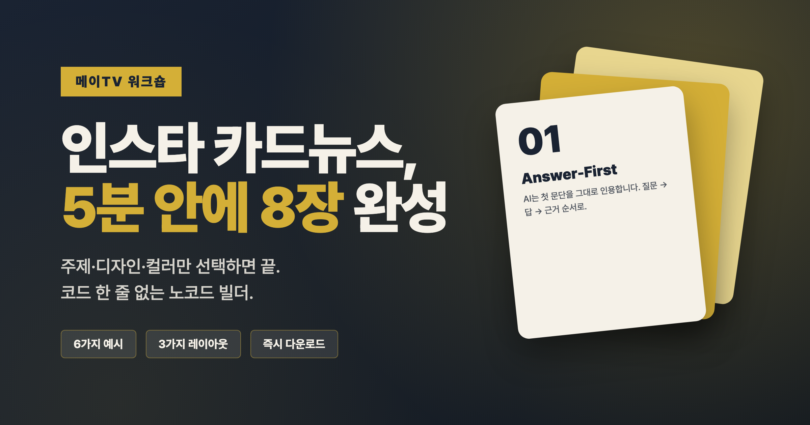

# 🎨 인스타 카드뉴스 빌더 (멀티타겟) — 농민·소상공인·일상 톤 지원

> **주제 한 줄만 입력하면** 인스타 카드뉴스 8장이 자동으로 완성되는 노코드 웹 빌더.
> 원본 빌더에 **타겟별 디자인 토큰 3종**(수확·시장·일기) + **9가지 컬러 팔레트** + **15개 예시**를 추가한 확장 버전.

🌐 **라이브**: https://instagram-cardnews-builder-multi.vercel.app
🔱 **포크 원본**: https://github.com/kjs369369/instagram-cardnews-builder



---

## ✨ 멀티타겟 확장 (이 포크의 차별점)

원본 빌더는 "메이TV/AICLab" 톤(네이비골드)이 중심이라 농민·소상공인 콘텐츠에는 어색했습니다.
이 포크는 타겟별로 **컬러·레이아웃·예시 카피**가 함께 바뀌는 디자인 토큰을 추가했습니다.

| 카테고리 | 디자인 토큰 | 레이아웃 | 예시 카피 톤 |
|----------|------------|---------|------------|
| 🌾 농민·귀농 | 수확 (흙갈+새벽노랑+크림) | minimal | "오늘 새벽 5시에 땄어요" |
| 🏪 소상공인 | 시장 (토마토+머스타드+우드) | bold | "오늘 들어온 갈치 50인분" |
| ☕ 일상·생활 | 일기 (잉크블루+살구+페이퍼) | classic | "현관문 닫는 순간 오늘 끝" |

**사용법**: 상단 `✨ 주제로 시작` → 카테고리에서 농민·소상공인·일상 중 선택 → 컬러·레이아웃이 자동으로 타겟에 맞춰집니다.
또는 `💡 예시로 시작` → 15개 예시 중 본인 타겟에 가까운 것 선택 → 본인 정보만 교체.

---

## 🤖 AI 리서치 기반 생성 (신규)

원본 빌더와 이 포크 초기 버전은 **템플릿 매트릭스 기반**이라 카피가 형식적이라는 한계가 있었습니다.
이 포크는 **OpenAI gpt-4o-mini API**를 연동해 카테고리별 시스템 프롬프트로 **실제 리서치된 카피**를 생성합니다.

### 흐름

1. 상단 `🔑 API 키` 클릭 → 본인 OpenAI 키 입력 (LocalStorage에만 저장, 서버 전송 없음)
2. `✨ 주제로 시작` → 주제·형식·톤·**카테고리** 선택
3. `🤖 AI 리서치 생성` 버튼 클릭 (기존 `✨ 템플릿 생성`과 별개)
4. 10~15초 후 카테고리에 맞는 톤으로 8장 자동 채워짐

### 카테고리별 시스템 프롬프트 핵심

각 카테고리는 다음 원칙을 강제로 적용합니다:

- **농민**: 작물명·시기·금액·수량 필수 / 외래어(SNS·GEO) 금지 / 5060대 어휘 / 정부 지원사업·시세 등 시의성 정보 우선
- **소상공인**: 매출·비용·시간 절감 직결 액션만 / 측정 가능한 수치 / 최근 배달앱·정책 변화 반영
- **일상**: "오늘 저녁 바로 할 수 있는 것" 수준의 작은 행동 / 거창한 자기계발 어휘 금지

### 비용

- 모델: gpt-4o-mini ($0.15 / 1M input, $0.60 / 1M output)
- 카드뉴스 1세트 ≈ **$0.002 (약 3원)**
- $5 충전 = 약 2,500세트

### 키 관리

- LocalStorage에만 저장 (이 브라우저에만 작동, 다른 기기·다른 브라우저는 별도 입력 필요)
- 서버로 전송되지 않음 — Vercel 백엔드 없음, OpenAI 직접 호출만
- 다른 사람과 컴퓨터 공유 시 사용 후 `키 삭제` 권장

---

## 🎓 강의 워크숍 가이드

### 핵심 가치
> **"빈 폼 앞에서 막막하지 않게."**
> 강의 흐름을 끊지 않는 즉시 작동 도구. 서버 없음, 회원가입 없음, 다운로드 즉시.

### 강의 시나리오 (총 30~45분)

| 시간 | 단계 | 강사가 할 일 | 수강생이 할 일 |
|------|------|--------------|---------------|
| **0~5분** | 데모 시연 | 1) 예시로 시작 클릭 → 6종 중 1개 선택<br>2) 미리보기 8장 ‹ › 넘겨가며 보기<br>3) 다운로드 → ZIP 풀어보기 | 화면 보기, "이게 5분 만에?" 반응 |
| **5~10분** | 첫 카드뉴스 만들기 | 함께 따라하기:<br>"주제로 시작" → 주제 입력 → 형식·톤·카테고리 선택 → 만들기 | 본인 주제로 같은 흐름 |
| **10~25분** | 다듬기 + 본인 정보 | STEP 4 본문 다듬기, STEP 5 본인 정보 (채널/이메일/책) 입력 | 폼 채우기, 미리보기 확인 |
| **25~35분** | 변형 비교 | 같은 본문에 컬러/레이아웃만 바꿔보기 (디자인 학습) | 3가지 레이아웃 × 6가지 컬러 비교 |
| **35~45분** | 다운로드 + 인스타 업로드 | ZIP 다운로드 시연 + 캐러셀 업로드 팁 | PNG 8장 인스타 게시 |

### 강의 시 자주 받는 질문

| Q | A |
|---|---|
| 무료인가요? | 네, 완전 무료. 서버도 없어 사용량 제한도 없습니다. |
| 회원가입? | 없습니다. 브라우저만 있으면 됩니다. |
| 입력한 내용 어디 가나요? | 본인 브라우저에만. 서버 전송 없음 → 자동 저장(localStorage)도 본인 PC만. |
| 모바일에서도 되나요? | 됩니다. 다만 큰 화면에서 작업하는 게 편합니다. |
| 8장 말고 다른 개수는? | 현재는 8장 고정 (cover + 본문 6 + cta). 인스타 캐러셀 권장 길이입니다. |

---

## ✨ 3가지 시작 방법

수강생이 막막함을 느끼지 않도록 3가지 진입로를 제공합니다.

### 1️⃣ ✨ 주제로 시작 (가장 빠름)
주제 한 줄 + 형식 + 톤 + 카테고리 선택 → **8장이 자동으로 채워짐**

- **형식 3종**: 💡 팁 시리즈 / 📋 단계별 가이드 / ⚖️ 비교·분석
- **톤 4종**: 정보성 / 감성적 / 위트있는 / 진지한 (어미 자동 변환)
- **카테고리 6종**: 일반·마케팅·테크·건강·재테크·독서 (컬러/레이아웃 자동 매칭)
- **🎲 다시 생성**: 같은 주제로 다른 변형 시도

= 총 **72가지 조합**의 자동 생성 패턴.

### 2️⃣ 💡 예시로 시작 (톤 학습용)
6개 완성 예시 중 하나를 통째로 가져옴. 수강생이 "톤이 어떻게 다른지" 비교 학습에 좋음.

| 예시 | 주제 | 톤 |
|------|------|-----|
| 🔍 GEO 생존전략 | AI 검색 시대 카피라이팅 | classic + 네이비골드 |
| 🤖 AI 도구 추천 5선 | 2026년 필수 AI 서비스 | bold + 오션 |
| 💪 30일 홈트 챌린지 | 4주 운동 루틴 | minimal + 체리 |
| 💼 부업 시작 6단계 | 월 100만원 부수입 | classic + 포레스트 |
| 📚 《원씽》 한 권 정리 | 책 핵심 6가지 | minimal + 와인살구 |
| 📸 인스타 마케팅 6법칙 | 팔로워 0→1만 | bold + 모노톤 |

### 3️⃣ 📝 직접 입력 (익숙해진 후)
빈 폼에서 처음부터 본인 손으로. 워크플로우를 익힌 다음 추천.

---

## 📋 폼 5단계 구성

| STEP | 무엇을 입력 | 결과 카드 |
|------|------------|----------|
| **1** | 주제 & 표지 (시리즈명·배지·제목·부제·강조) | 1번 카드 (cover) |
| **2** | 레이아웃 (classic / minimal / bold) | 전체 톤 |
| **3** | 컬러 팔레트 (프리셋 6종 + HEX 커스텀) | 전체 컬러 |
| **4** | 본문 카드 6장 (숫자·소제목·제목·본문) | 2~7번 카드 (content) |
| **5** | 본인 정보 (채널·CTA·홈페이지·이메일·책) | 8번 카드 (cta) |

각 입력에 즉시 우측 미리보기 반영. 키보드 `← →` 또는 썸네일 클릭으로 8장 모두 확인.

---

## 🎨 디자인 시스템

### 레이아웃 3종 — 같은 내용도 인상이 다름

| 레이아웃 | 분위기 | 어울리는 주제 |
|---------|-------|--------------|
| **classic** | 정보 위주, 신뢰감 | 마케팅·재테크·일반 정보성 |
| **minimal** | 깔끔, 감성적 | 건강·독서·자기계발·라이프스타일 |
| **bold** | 강한 임팩트 | 테크·트렌드·이벤트성·반전이 있는 콘텐츠 |

### 컬러 팔레트 프리셋 6종

| 이름 | 분위기 | HEX |
|------|-------|-----|
| 네이비골드 | 정보·신뢰 | `#1a2332` · `#d4af37` · `#f5f1e8` |
| 와인살구 | 감성·따뜻 | `#5c2a3c` · `#e8a87c` · `#fdf6ec` |
| 모노톤 | 미니멀·세련 | `#0a0a0a` · `#666666` · `#f0f0f0` |
| 포레스트 | 안정·자연 | `#1d3b2a` · `#c9a957` · `#f3efe4` |
| 오션 | 시원·테크 | `#0a3d62` · `#f5af19` · `#eef5f9` |
| 체리 | 활기·강조 | `#3d0f17` · `#ff6b6b` · `#fff5f5` |

마음에 안 들면 HEX 색상으로 직접 입력 가능 → 본인 브랜드 컬러로 정확히 맞춤.

### 출력 사양

| 항목 | 값 |
|------|---|
| 사이즈 | **1080 × 1350px** (인스타 4:5 세로) |
| 카드 수 | **8장** (cover 1 + content 6 + cta 1) |
| 폰트 | Pretendard Variable (CDN) |
| 해상도 | 2배 (retina 2160×2700) |
| 다운로드 | ZIP 한 번에 8장 |

---

## ⌨️ 단축키

| 키 | 동작 |
|----|------|
| `←` / `→` | 카드 미리보기 이전/다음 |
| `Esc` | 모달 닫기 |
| `Enter` | 주제 모달에서 즉시 생성 |

---

## 🏗️ 기술 스택 (개발자용)

| 영역 | 기술 |
|------|------|
| UI | Vanilla HTML/CSS/JS (프레임워크 없음) |
| 폰트 | Pretendard Variable (CDN) |
| PNG 캡처 | [html-to-image](https://github.com/bubkoo/html-to-image) (CDN) |
| ZIP 압축 | [JSZip](https://stuk.github.io/jszip/) (CDN) |
| 호스팅 | Vercel (정적, 빌드 단계 없음) |

빌드 단계 0 — `git push` 하면 즉시 배포됩니다.

---

## 📁 파일 구조

```
instagram-cardnews-builder/
├── 📜 index.html          # 폼 + 모달 마크업
├── 🎨 styles.css          # UI 스타일
├── 🧠 app.js              # state · 렌더링 · 다운로드 핵심 로직
├── 📦 examples.js         # 6종 완성 예시 데이터
├── 🤖 topic-generator.js  # 주제 → 8장 자동 생성 매트릭스
├── 🎨 og.png              # OG 미리보기 (1200×630)
└── 🛠 vercel.json         # 정적 호스팅 설정
```

---

## 🔒 보안 & 프라이버시

- **모든 입력은 본인 브라우저에서만 처리** — 서버 전송 0
- **자동 저장(localStorage)도 본인 PC에만** — 다른 곳 안 보냄
- **외부 의존성은 CDN 3개** (Pretendard 폰트 · html-to-image · JSZip) — 글로벌 표준 라이브러리
- **모든 동적 HTML은 `escapeHtml()` + `Range.createContextualFragment` 패턴으로 XSS 차단**

---

## 🔗 자매 프로젝트

| 프로젝트 | 용도 | 누구한테 좋은지 |
|---------|------|----------------|
| **이 프로젝트 (웹 빌더)** | 노코드로 즉시 만들기 | 수강생 워크숍, 코드 부담 없이 시작 |
| **[코드 버전](https://github.com/kjs369369/instagram-cardnews-main)** | CLI + Playwright | 본인 자동화 시스템 구축, 개발 학습 |

강의에서는 **결과를 먼저 보여주고(코드 버전), 즉시 만들어보기(이 웹 버전)** 흐름이 효과적입니다.

---

## 💡 v2 확장 아이디어

강의 후기를 반영해 추가하면 좋은 것들:

| 기능 | 효과 |
|------|------|
| AI 본문 생성 (Claude API, BYOK) | 더 자연스러운 본문 |
| 자동 저장 (localStorage) | 새로고침 사고 방지 |
| JSON 내보내기/가져오기 | 강사가 미리 만들어 배포 가능 |
| 카드별 개별 PNG 다운로드 | 부분 수정 시 편의 |
| 공유 링크 (URL state base64) | 강의 후 작품 자랑 |
| 인스타 캡션 자동 생성 | 카드뉴스 + 캡션까지 한 번에 |

---

## 👤 운영자

- **김진수 (May 작가)** — AICLab 소장 / 메이랜드AI비즈랩 CEO
- **유튜브**: [@AICLab_TV](https://www.youtube.com/@AICLab_TV)
- **저서**: 《이것이 GEO마케팅이다》
- **이메일**: info@aiclab2020.com

---

## 📄 라이선스

MIT — 강의·교육·상업적 활용 자유. 강의에 그대로 활용하셔도 좋습니다 (크레딧만 부탁드려요).
